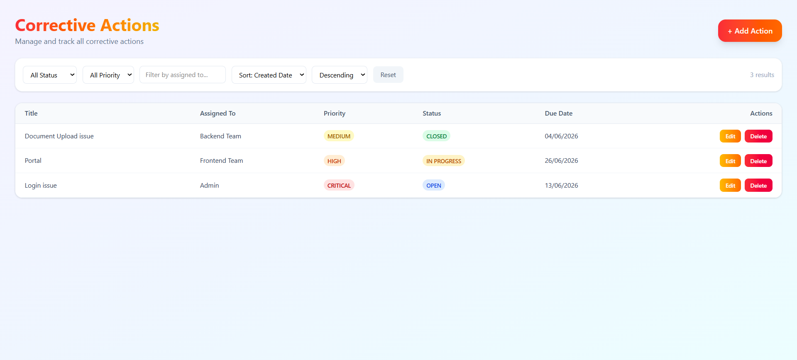
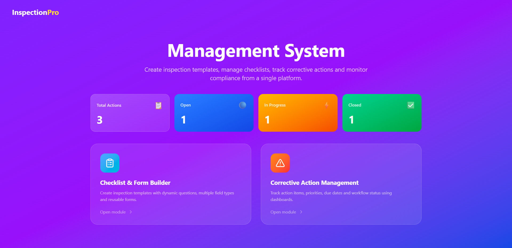
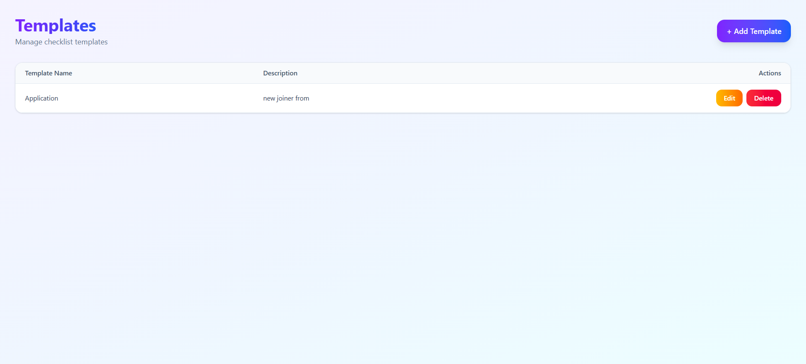
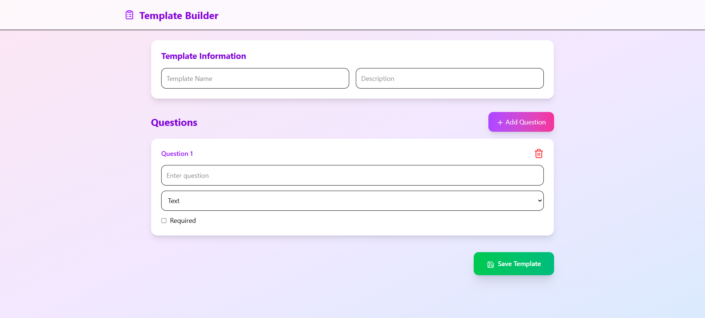
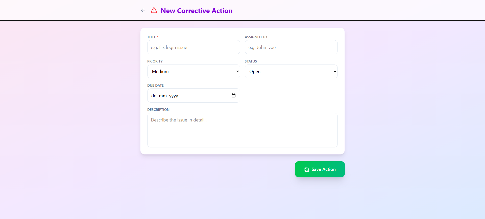

# Checklist
Demo project

## Overview
This project is a web application that manages checklist and corrective actions.

## Features

### Template Module
- Create new checklist
- View template details
- Update existing checklist
- Delete checklist
- Search and manage template records

### Corrective Action Module
- Create corrective actions
- View corrective action details
- Update corrective actions
- Delete corrective actions
- Filter corrective actions based on criteria
- Sort corrective actions by different fields
- Track and manage action status

## CRUD Operations

| Module | Create | Read | Update | Delete |
|----------|----------|----------|----------|----------|
| checklist | ✅ | ✅ | ✅ | ✅ |
| Corrective Action | ✅ | ✅ | ✅ | ✅ |

## Additional Functionality

### Filtering
Users can filter corrective actions based on:
- Status
- Priority
- Date
- Assigned user
*(modify according to your implementation)*

### Sorting
Users can sort corrective actions by:
- Created Date
- Updated Date
- Priority
- Status
*(modify according to your implementation)*

## Technologies Used
- Frontend: React
- Backend: Node.js
- Database: PostgreSQL

## Screenshots
    